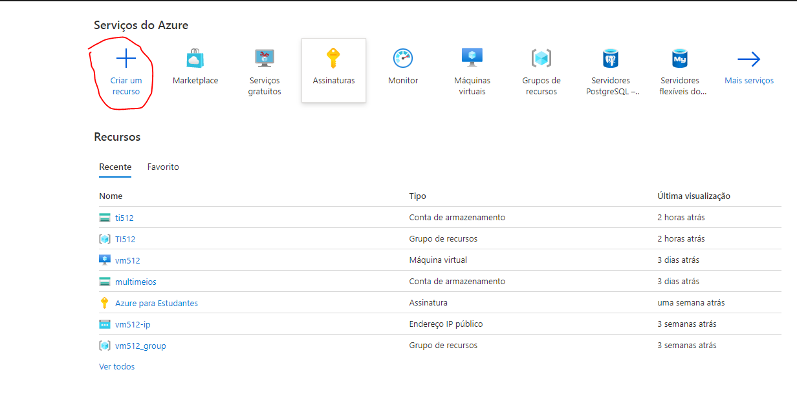
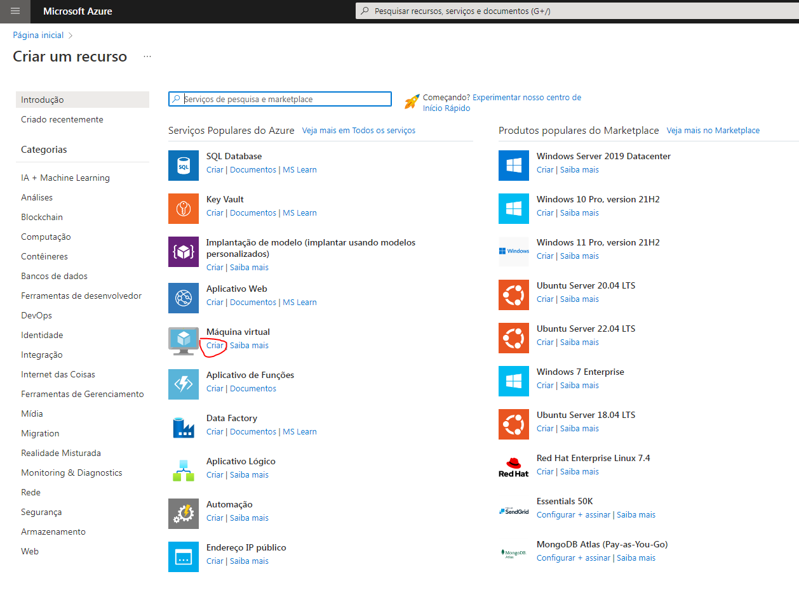
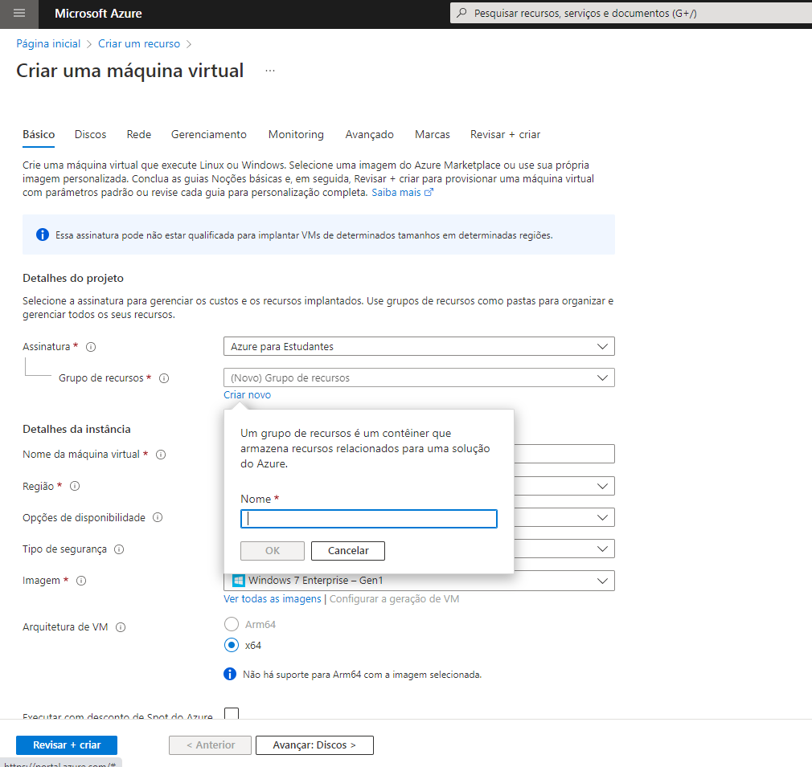
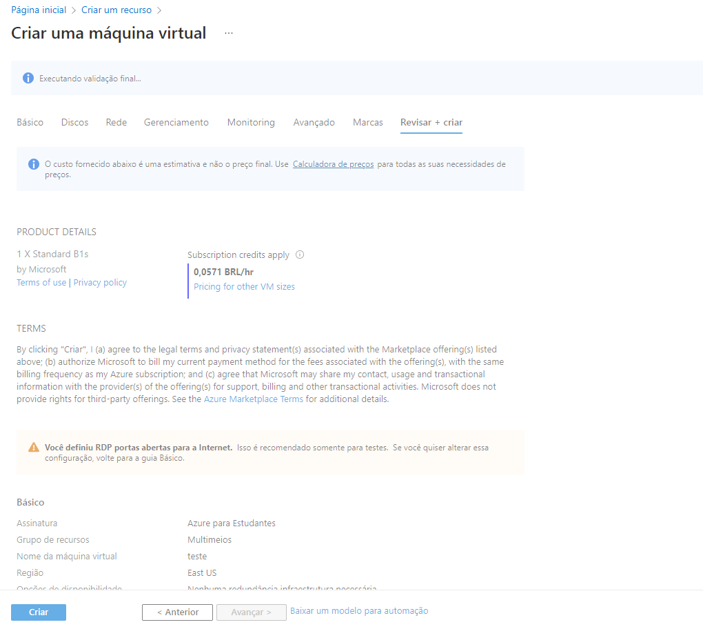
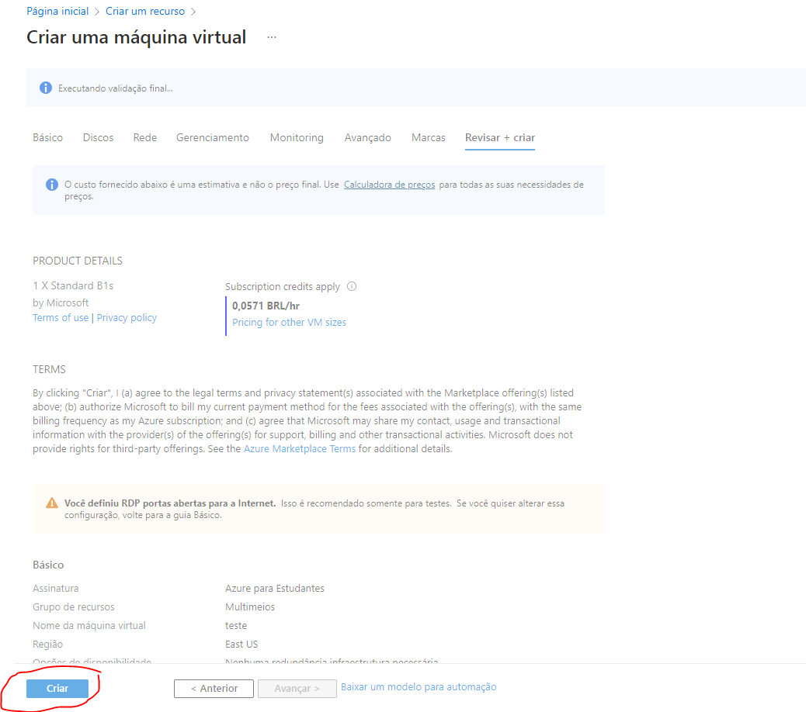

# AZ-900-CREATE-VM

Acesse https://portal.azure.com/#home

Clique em criar recurso

Busque por máquina virtual e clique em criar

Em grupo de recursos clique em  Criar novo

Alimente as informações conforme orientado até chegar no campo revisar e criar

Clique em criar

